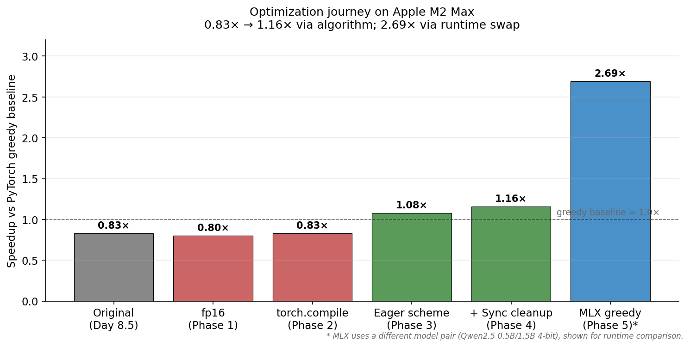
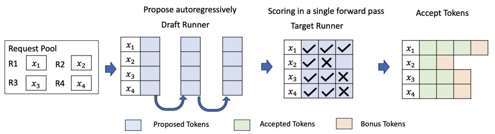
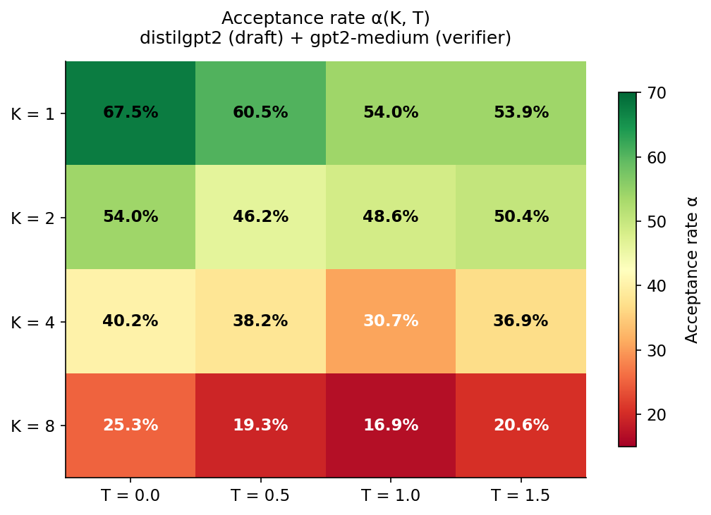
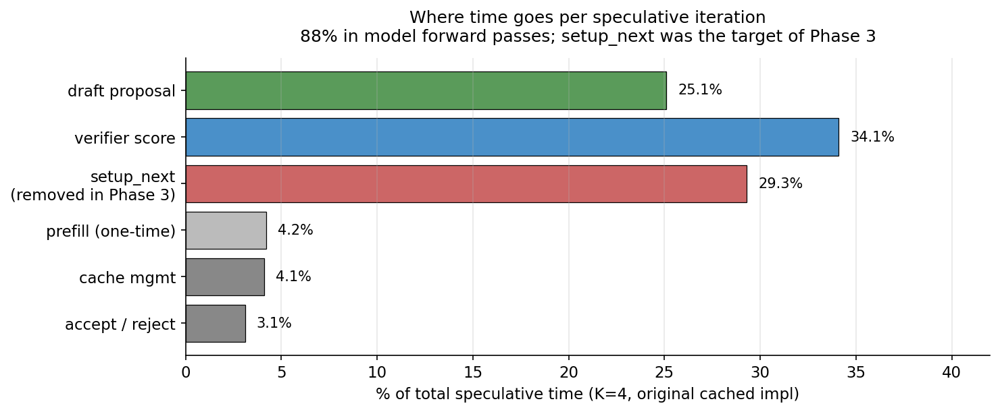
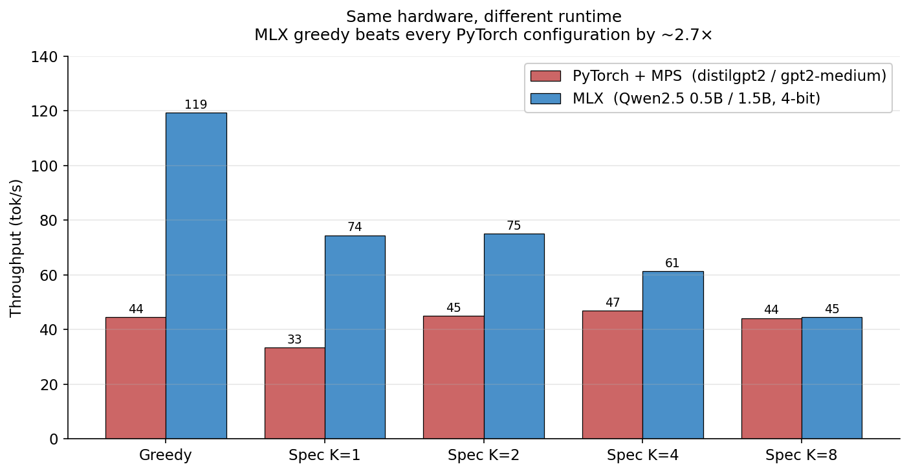

<div align="center">

# Speculative Decoding on Apple Silicon

**A from-scratch PyTorch implementation of [Leviathan et al. 2023](https://arxiv.org/abs/2211.17192), benchmarked and optimized on Apple M2 Max.**

*Provably lossless. 1.16× speedup over greedy in PyTorch + MPS. 2.69× greedy on Apple MLX.*

[Paper](https://arxiv.org/abs/2211.17192) · [Optimization deep-dive](docs/optimizations.md) · [Project spec](docs/spec.md) · [Progress log](progress.md)

</div>

---

## Key results

100-token generation, temperature 0, 5 varied prompts, Apple M2 Max.

<p align="center">
  
</p>

| Configuration | Throughput | vs PyTorch greedy |
|---|---|---|
| PyTorch greedy (gpt2-medium) | 44.5 tok/s | 1.00× |
| **PyTorch speculative, K=4 (this work)** | **46.9 tok/s** | **1.06×** |
| MLX greedy (Qwen2.5-1.5B 4-bit) | **119.3 tok/s** | **2.69×** |
| MLX speculative, K=2 (mlx-lm built-in) | 75.1 tok/s | 1.69× |

Output at temperature 0 is **bit-identical** to verifier-only greedy decoding. The mathematical guarantee from the paper holds in this implementation, verified by an exact-match correctness test.

---

## What's here

- A correct, readable implementation of speculative decoding in ~200 lines of PyTorch.
- A profiling harness that decomposes per-iteration time into draft / verifier / cache management / accept-reject phases.
- A 5-phase optimization sequence taking the PyTorch implementation from **0.83×** to **1.16×** of greedy on M2 Max - including which phases did *not* work and why.
- A side-by-side benchmark with Apple MLX showing the inference runtime, not the algorithm, is the dominant lever on Apple Silicon.

---

## Quick start

```bash
pip install -r requirements.txt

# Correctness check - must pass before any benchmark is trustworthy
python src/speculative.py --test
# PASS: cached spec matches verifier-only greedy (30 tokens)

# Generate text
python src/speculative.py --prompt "The transformer architecture" --n_tokens 100 --k 4

# Throughput benchmark
python benchmarks/throughput.py --n_tokens 100
```

---

## How it works

<p align="center">
  
</p>

<sub>Diagram via third-party blog (vLLM-style serving framing); single-request analog of what this repo implements.</sub>

```
prompt ──▶  draft model proposes  [t1, t2, t3, t4]
       ──▶  verifier scores all 4 in ONE parallel forward pass
       ──▶  accept t1, t2; reject t3  ──▶  sample correction c from max(0, p − q)
       ──▶  append [t1, t2, c]   (3 new tokens for 1 verifier pass)
```

The verifier scores K draft tokens at once because **reading its weights from memory dominates a forward pass**; the marginal cost of feeding extra tokens is small. The acceptance rule - accept with probability `min(1, p / q)`, otherwise resample from the residual `max(0, p − q)` normalized - is a change of variables that makes the output distribution exactly equal to verifier-only sampling. No quality loss.

---

## Findings

**The algorithm works as the paper predicts.** Acceptance rate α scales with K and temperature in line with theory: 67% at K=1 / temp=0, dropping to 25% at K=8 / temp=0. At temperature 0 the speculative output is bit-identical to verifier-only greedy decoding.

<p align="center">
  
</p>

**The bottleneck on PyTorch + MPS is per-call overhead.** Profiling with `torch.mps.synchronize()` reveals **~25 ms fixed cost per verifier forward pass** regardless of input length, with marginal cost per token of only ~0.7–1 ms. 88% of speculative iteration time is inside model forward passes; cache management and accept/reject logic combined account for ~7%.

<p align="center">
  
</p>

**The biggest single optimization was a loop reorganization.** Phase 3 of the optimization pass ("eager scheme") eliminated the end-of-iter forward passes that prepare a saved logit for the next iter, by feeding the previous-iter's last token at the start of each iter as the first draft proposal pass. *One fewer forward pass × ~25 ms* = the change that crossed 1.0×.

**Two things that did not work** (also useful information):

- fp16 inference: no speedup, because the MPS bottleneck is not memory bandwidth.
- `torch.compile`: errors on MPS for these models (`aten.var_mean.correction` in LayerNorm has no lowering).

**The runtime is the bigger lever than the algorithm.** Apple MLX with a similar-sized 4-bit quantized model pair achieves **2.69× the throughput of optimized PyTorch greedy on the same hardware**, with no algorithmic change. But inside MLX, speculative decoding doesn't help: 4-bit models are already memory-bandwidth-fast, the draft/verifier cost ratio γ collapses, and the algorithm's overhead exceeds its benefit. **Speculative decoding helps when the verifier is slow.**

<p align="center">
  
</p>

The engineering detail behind these findings, including code diffs for each phase, lives in [`docs/optimizations.md`](docs/optimizations.md).

---

## Model pair

| Role | Model | Parameters | Tokenizer |
|---|---|---|---|
| Draft | `distilgpt2` | 82M | GPT-2 BPE (50257) |
| Verifier | `gpt2-medium` | 355M | GPT-2 BPE (50257) |

A shared tokenizer is required by the acceptance criterion: `p(x)` and `q(x)` must refer to the same vocabulary.

---

## Hardware and software

| | |
|---|---|
| Chip | Apple M2 Max (12-core CPU, 30-core GPU, unified memory) |
| OS | macOS 14+ |
| PyTorch | 2.1+ with MPS backend |
| Transformers | 4.36+ |
| MLX (optional) | 0.29+ |

---

## Reproducing

All benchmarks are deterministic at temperature 0 with seed 42 (set in `src/utils.py`).

```bash
# Correctness, throughput, profiling
python src/speculative.py --test
python benchmarks/throughput.py --n_tokens 100
python benchmarks/profile.py

# Algorithm characterization
python benchmarks/alpha_sweep.py --n_tokens 30 --n_prompts 20
python benchmarks/seq_length.py --n_tokens 100

# MLX comparison
pip install mlx mlx-lm
python benchmarks/mlx_comparison.py --n_tokens 100

# Unit tests
python tests/test_acceptance.py
```

Per-run variance on MPS is meaningful (±5–10% on absolute tok/s, driven by thermal state and process scheduling). Within-run speedup ratios are more stable than absolute throughput.

---

## Citation

If you reference these findings, please cite the original paper:

```bibtex
@inproceedings{leviathan2023fast,
  title     = {Fast Inference from Transformers via Speculative Decoding},
  author    = {Leviathan, Yaniv and Kalman, Matan and Matias, Yossi},
  booktitle = {International Conference on Machine Learning},
  year      = {2023},
  url       = {https://arxiv.org/abs/2211.17192}
}

@article{chen2023accelerating,
  title   = {Accelerating Large Language Model Decoding with Speculative Sampling},
  author  = {Chen, Charlie and Borgeaud, Sebastian and Irving, Geoffrey and Lespiau, Jean-Baptiste and Sifre, Laurent and Jumper, John},
  journal = {arXiv preprint arXiv:2302.01318},
  year    = {2023},
  url     = {https://arxiv.org/abs/2302.01318}
}
```

---

## License

[MIT](LICENSE)
